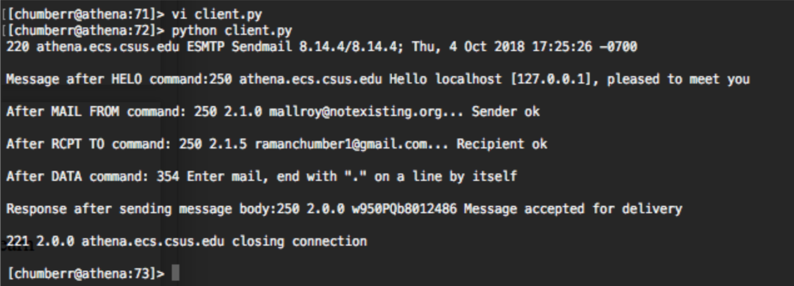
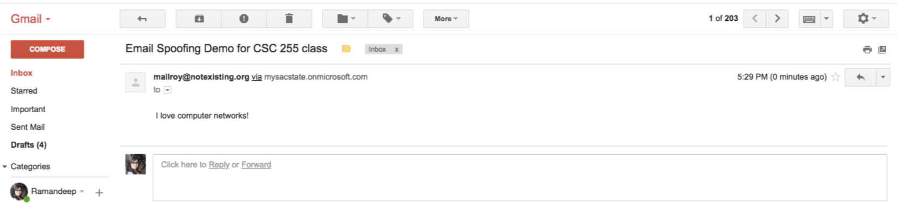

## Socket Programming using python – Email Spoofing

### Goal: 

The goal of this programming assignment is to create a simple mail client that sends email to any recipient. The client will need to establish a TCP connection with a mail server (e.g. ECS mail server: gaia.ecs.cus.edu in this case), dialogue with the mail server using the SMTP protocol, send an email message to a recipient (e.g. to myself) via the mail server, and finally close the TCP connection with the mail server.

client.py program is written in python. The following results were obtained after running the program.

Spoofed email received at personal email address. Email sender is mallroy@nonexisting.org. 
The subject is: Email Spoofing Demo for CSC 255 class. 
The message says “I love computer networks!”.

